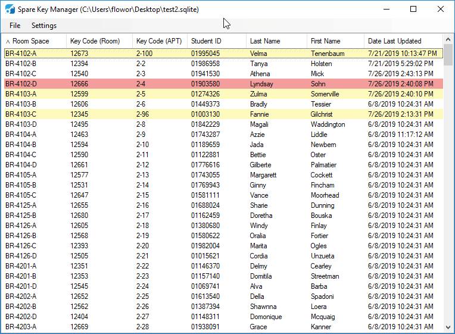

# Key Manager

Key Manger is a tool that helps you manage and keep track of spare keys. 

## Features
- Create, update, delete entries
- Change the status of an apartment or a room key to missing
- Customize the status colors
- Create a new, or select an existing database
- Import/export spare key list from a Microsoft Excel xlsx file
- Generate a status email for a particular resident to be sent out

## Preview

